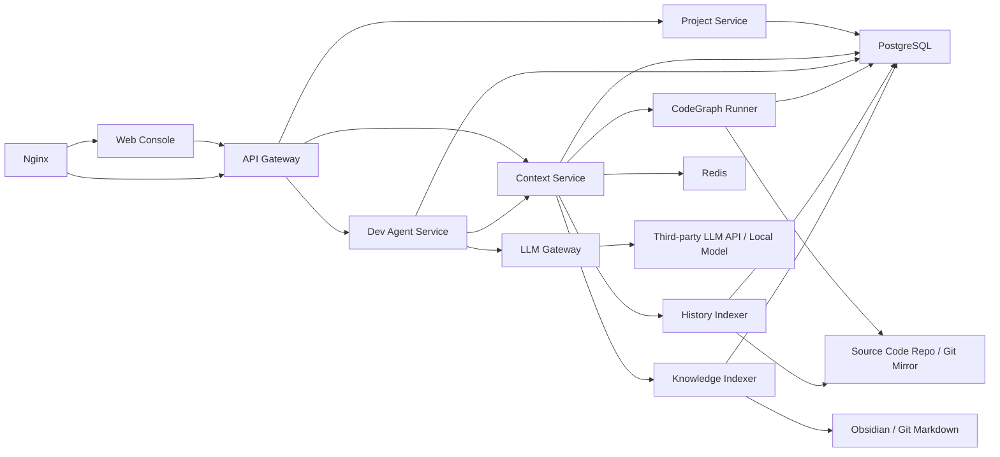
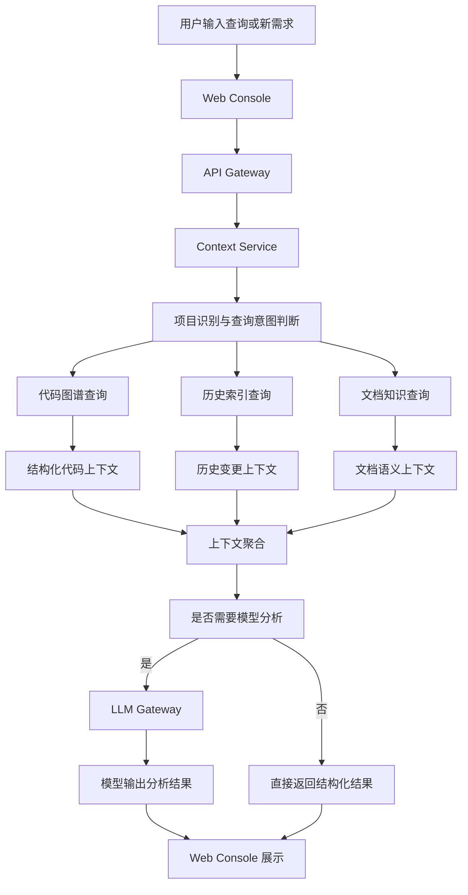

# 历史代码智能分析与智能开发平台详细设计（LLD）

## 1. 设计范围

本文档描述平台的详细模块划分、技术栈、组件要求、交互关系、数据流、核心数据对象和关键流程，作为研发实施、部署落地和后续扩展的直接参考。

## 2. 技术栈与选型要求

### 2.1 总体技术原则

- 服务端统一采用 `Java 21`
- 架构风格采用前后端分离、服务模块化、任务与在线服务分离
- 优先选择可内网部署、成熟稳定、运维成本低的组件
- 优先选择可替换的大模型接入方式，避免绑定单一模型厂商
- 第一阶段以“历史分析 + 调用关系”落地为核心，控制组件数量

### 2.2 推荐技术栈

#### 服务端

- JDK：`OpenJDK 21`
- 核心框架：`Spring Boot 3.3+`
- Web 框架：`Spring Web MVC`
- 安全框架：`Spring Security`
- 数据访问：`Spring Data JPA + MyBatis-Flex`
- 任务调度：`Spring Scheduling`，后续可扩展 `XXL-JOB` 或 `Quartz`
- HTTP Client：`Spring WebClient`
- 对象映射：`MapStruct`
- JSON 处理：`Jackson`

说明：

- `JPA` 适合项目、配置、审计、文档元数据等标准实体管理。
- `MyBatis-Flex` 适合符号关系、历史查询、统计分析等复杂 SQL 场景。

#### 前端

- 框架：`Vue 3 + TypeScript`
- 构建工具：`Vite`
- UI 组件库：`Element Plus`
- 图可视化：`Vue Flow` 或 `Cytoscape.js`
- 请求层：`Axios`
- 状态管理：`Pinia`

说明：

- 前端主要承载项目切换、图谱查看、历史变更分析和需求分析结果展示，采用成熟组件栈可缩短实现周期。

#### 数据与存储

- 主数据库：`PostgreSQL 15+`
- 缓存：`Redis 7`
- 全文检索：`PostgreSQL FTS`
- 向量检索：`Qdrant`
- 文件存储：本地 NAS 或内网文件卷

#### 文档知识库

- 文档生产与维护：`Obsidian`
- 文档存储格式：`Markdown + YAML Frontmatter`
- 文档版本管理：`Git`

#### 代码图谱与历史分析

- 代码图谱主引擎：`CodeGraph`
- 备选评估：`GitNexus`
- Git 操作库：`JGit`
- 差异与 blame 分析：优先 `JGit`，复杂场景可回退调用原生 `git`

#### 模型接入

- 统一模型协议：`OpenAI-compatible API`
- 网关实现：自建 `LLM Gateway`
- 支持模型：
  - Claude
  - OpenAI
  - Gemini
  - DeepSeek
  - Qwen
  - 本地离线模型

#### 部署与运维

- 容器化：`Docker`
- 编排：`Docker Compose`，后续兼容 `Kubernetes`
- 反向代理：`Nginx`
- 日志：`Loki + Grafana` 或 `ELK`，第一阶段可简化为文件日志 + Grafana
- 监控：`Prometheus + Grafana`

### 2.3 统一终态组件原则

- 第一阶段即按终态技术栈完成系统骨架建设。
- 核心组件不因阶段变化而替换，只按计划逐步启用能力。
- 所有模块接口、数据库模型、部署结构均按终态方案设计。
- 允许某些能力延后启用，但不允许因为阶段推进重做底座。

## 3. 组件清单与部署要求

### 3.1 一期必选组件

#### `web-console`

- 类型：在线服务
- 技术：`Vue 3 + TypeScript + Element Plus`
- 职责：
  - 项目切换
  - 查询输入
  - 调用链与历史结果展示
  - 新需求分析结果展示

#### `api-gateway`

- 类型：在线服务
- 技术：`Spring Boot 3 + Spring Security`
- 职责：
  - 统一 API 入口
  - 登录鉴权
  - 限流与审计
  - 请求路由

#### `project-service`

- 类型：在线服务
- 技术：`Spring Boot 3`
- 职责：
  - 项目注册
  - 仓库配置
  - 文档仓配置
  - 模型策略配置

#### `context-service`

- 类型：在线服务
- 技术：`Spring Boot 3`
- 职责：
  - 查询意图识别
  - 代码图谱、历史索引、文档索引统一编排
  - 上下文裁剪与聚合

#### `codegraph-runner`

- 类型：后台任务服务
- 技术：`Java 21 + Process Executor`
- 职责：
  - 调用 `CodeGraph` 建立代码图谱
  - 管理全量和增量索引任务
  - 回写符号和关系边到 PostgreSQL

#### `history-indexer`

- 类型：后台任务服务
- 技术：`Java 21 + JGit`
- 职责：
  - 解析 Git 提交历史
  - 生成提交、文件、符号关联
  - 维护版本与需求映射

#### `knowledge-indexer`

- 类型：后台任务服务
- 技术：`Java 21`
- 职责：
  - 扫描 Markdown 文档
  - 解析 frontmatter
  - 建立文档索引和关联

#### `postgres`

- 类型：基础组件
- 技术：`PostgreSQL 15+`
- 职责：
  - 存储项目、代码符号、关系边、历史、文档、配置、审计等核心数据

#### `redis`

- 类型：基础组件
- 技术：`Redis 7`
- 职责：
  - 项目元数据缓存
  - 热点查询缓存
  - 任务状态缓存
  - 会话级上下文缓存

### 3.2 二期建议组件

#### `llm-gateway`

- 类型：在线服务
- 技术：`Spring Boot 3`
- 职责：
  - 封装第三方模型 API
  - 实现模型路由、重试、回退和审计

#### `qdrant`

- 类型：基础组件
- 职责：
  - 相似需求召回
  - 相似文档召回
  - 语义补充检索

### 3.3 三期扩展组件

#### `dev-agent-service`

- 类型：在线服务
- 技术：`Spring Boot 3`
- 职责：
  - 需求结构化解析
  - 改造方案生成
  - 风险点与测试建议生成

说明：

- 上述组件均属于终态方案组成部分。
- 若资源允许，建议在第一阶段完成全部基础组件部署，仅按阶段启用对应能力。
- 若出于资源控制需要延后部署 `qdrant` 或 `dev-agent-service`，其接口与数据模型也必须在第一阶段预留。

## 4. 技术约束与组件要求

### 4.1 离线部署要求

- 所有服务需支持在无外网环境运行
- Docker 镜像需支持离线导入
- Maven 依赖需支持内网私服
- Node 包依赖需支持内网镜像源
- 所有第三方组件需提供离线安装说明

### 4.2 项目接入要求

- 每个项目必须通过 `project_id` 管理
- 项目必须配置唯一代码仓地址和默认分支
- 项目支持绑定独立文档目录或文档仓
- 已接入项目切换必须做到秒级查询切换

### 4.3 模型接入要求

- 模型调用统一通过 `llm-gateway`
- 不允许业务模块直接调用外部模型 API
- 必须支持项目级模型策略
- 必须支持模型超时、熔断、回退、本地模型兜底
- 敏感项目必须可配置为仅允许本地模型

### 4.4 索引构建要求

- 新项目必须支持首次全量索引
- 已接入项目必须支持增量索引
- 代码索引与历史索引应分开执行，避免互相阻塞
- 大仓首次接入可先索引默认分支，再补充长历史

### 4.5 安全要求

- 必须支持统一登录鉴权
- 必须支持项目级权限控制
- 必须记录关键查询日志与模型调用日志
- API Key 必须加密存储

## 5. 模块设计

### 5.1 Web Console

职责：

- 提供项目切换界面
- 提供代码查询、历史查询、知识查询、新需求输入界面
- 展示调用链、影响分析、历史变更、需求分析结果

输入：

- 用户查询
- 项目切换指令
- 新需求描述

输出：

- 查询结果视图
- 模块图、调用链图、数据流图
- 智能分析结果

推荐实现：

- Vue 页面按“项目首页、代码分析、历史分析、需求分析、系统配置”分区
- 图关系视图采用 `Vue Flow`
- 历史列表与详情采用 `Element Plus Table` 风格

### 5.2 API Gateway

职责：

- 统一对外 API
- 鉴权、审计、限流
- 请求分发到项目服务、上下文服务、模型服务

推荐实现：

- 使用 `Spring Security + JWT/OIDC`
- 与企业 LDAP、AD 或 OIDC 统一认证对接
- 对查询接口增加项目权限校验

### 5.3 Project Service

职责：

- 管理项目注册信息
- 维护仓库配置、文档路径、模型策略
- 提供项目级元数据

核心字段：

- `project_id`
- `project_name`
- `repo_url`
- `default_branch`
- `language_stack`
- `doc_repo_path`
- `model_profile_id`

推荐实现：

- 标准 CRUD 使用 `Spring Data JPA`
- 项目配置变更后异步通知索引服务刷新

### 5.4 CodeGraph Runner

职责：

- 执行代码图谱初始化和增量更新
- 输出符号、关系边、文件结构、调用链信息

输入：

- 代码仓目录
- 分支

输出：

- `symbols`
- `symbol_edges`
- `files`
- `graph_index_meta`

推荐实现：

- Java 服务负责调度，不直接重写图谱解析器
- 通过受控命令执行调用 `CodeGraph`
- 解析结果统一写入 PostgreSQL
- 对失败任务记录任务日志和错误快照

### 5.5 History Indexer

职责：

- 扫描 Git 历史
- 解析 commit、diff、blame、tag、release
- 建立提交与文件、符号、需求之间的关联

输入：

- Git 仓库
- 历史范围

输出：

- `commits`
- `commit_files`
- `commit_symbols`
- `releases`

推荐实现：

- 优先使用 `JGit`
- 对 `blame`、大 diff、特殊编码文件保留原生命令回退机制
- commit message 中通过正则提取需求号、缺陷号、版本号

### 5.6 Knowledge Indexer

职责：

- 扫描 Markdown 文档
- 解析 frontmatter
- 建立文档与需求、路径、符号、提交的关联

输入：

- 文档目录

输出：

- `documents`
- `requirements`
- `document_links`

推荐实现：

- 支持按项目约定统一 frontmatter 模板
- 使用 `commonmark` 或等价库解析 Markdown
- 文档解析失败时记录告警但不阻塞整批任务

### 5.7 Context Service

职责：

- 根据用户问题构建最小必要上下文
- 统一调度图谱、历史、文档三类查询
- 输出面向前端或模型的上下文结果

输出内容：

- 结构化事实包
- 文档摘要
- 相关代码节点
- 历史变更摘要

推荐实现：

- 查询意图至少分为：
  - 代码定位
  - 调用关系
  - 历史追溯
  - 文档回溯
  - 新需求分析
- 对结构化结果先返回事实，再决定是否进入模型总结

### 5.8 LLM Gateway

职责：

- 统一封装第三方模型 API
- 提供模型路由、回退、超时、审计
- 支持项目级模型选择

支持字段：

- `provider`
- `base_url`
- `api_key`
- `model_name`
- `timeout`
- `fallback_model`

推荐实现：

- 对外统一提供 `/v1/chat/completions`
- 屏蔽不同模型厂商差异
- 为每次模型请求记录项目、用户、模型、耗时、Token 统计

### 5.9 Dev Agent Service

职责：

- 将新需求转为结构化任务
- 组织上下文
- 生成改造建议
- 生成测试建议

输出：

- 影响范围列表
- 改造建议
- 风险点
- 测试建议

推荐实现：

- 第一阶段先生成分析报告，不直接改代码
- 后续再与 IDE Agent、代码执行器或补丁服务打通

## 6. 模块图

## 7. 数据流图

## 8. 核心数据模型

### 8.1 projects

- `id`
- `name`
- `repo_url`
- `default_branch`
- `language_stack`
- `doc_repo_path`
- `status`

### 8.2 symbols

- `id`
- `project_id`
- `file_path`
- `symbol_name`
- `symbol_kind`
- `signature`
- `line_start`
- `line_end`

### 8.3 symbol_edges

- `id`
- `project_id`
- `source_symbol_id`
- `target_symbol_id`
- `edge_type`

说明：

- `edge_type` 包括 `CALLS`、`IMPORTS`、`IMPLEMENTS`、`EXTENDS`、`REFERENCES`

### 8.4 commits

- `id`
- `project_id`
- `commit_hash`
- `author`
- `commit_time`
- `message`
- `branch_name`

### 8.5 commit_symbols

- `id`
- `project_id`
- `commit_id`
- `symbol_id`
- `change_type`

### 8.6 requirements

- `id`
- `project_id`
- `requirement_code`
- `title`
- `status`
- `source_doc_id`

### 8.7 documents

- `id`
- `project_id`
- `doc_path`
- `doc_type`
- `title`
- `metadata_json`

### 8.8 document_links

- `id`
- `project_id`
- `document_id`
- `symbol_id`
- `commit_id`
- `requirement_id`

### 8.9 model_profiles

- `id`
- `project_id`
- `provider`
- `base_url`
- `model_name`
- `embedding_model`
- `timeout_seconds`
- `fallback_model`
- `enable_local_only`

### 8.10 query_logs

- `id`
- `project_id`
- `user_id`
- `query_type`
- `query_text`
- `model_used`
- `cost_token`
- `created_at`

## 9. 关键流程设计

### 9.1 新项目接入流程

1. 管理员在 Project Service 创建项目。
2. 系统拉取代码仓和文档仓。
3. CodeGraph Runner 执行全量索引。
4. History Indexer 执行 Git 历史回放。
5. Knowledge Indexer 扫描并索引文档。
6. 数据写入 PostgreSQL。
7. 项目状态切换为可用。

### 9.2 增量同步流程

1. 检测 Git 新提交或 webhook 事件。
2. 触发代码增量索引。
3. 触发历史增量索引。
4. 如文档变更则触发文档增量索引。
5. 更新上下文服务缓存。

### 9.3 新需求智能分析流程

1. 用户输入需求描述。
2. Dev Agent Service 解析需求关键词、功能域和改动类型。
3. Context Service 查询相似需求、调用链、历史变更、相关文档。
4. 组装分析上下文。
5. LLM Gateway 调用指定模型生成改造建议。
6. 返回影响范围、风险点和测试建议。

## 10. 接口设计

### 10.1 项目管理接口

- `POST /api/projects`
- `GET /api/projects`
- `GET /api/projects/{id}`
- `POST /api/projects/{id}/index`

### 10.2 查询接口

- `POST /api/query/code`
- `POST /api/query/history`
- `POST /api/query/knowledge`
- `POST /api/query/ask`

### 10.3 智能开发接口

- `POST /api/agent/requirement/analyze`
- `POST /api/agent/requirement/plan`
- `POST /api/agent/impact/analyze`

### 10.4 模型配置接口

- `POST /api/models`
- `GET /api/models`
- `POST /api/projects/{id}/model-policy`

## 11. 缓存与性能设计

- 热门项目元数据缓存
- 常用调用链查询结果缓存
- 最近查询上下文缓存
- 增量索引优先于全量重建
- 图谱查询、历史查询、文档查询分层缓存

性能建议：

- PostgreSQL 为 `symbols(project_id, symbol_name)`、`symbol_edges(project_id, source_symbol_id)`、`commits(project_id, commit_time)` 建立索引
- Redis 缓存热点项目查询 5 至 30 分钟
- 大项目首次全量索引采用后台异步任务，不阻塞前台操作

## 12. 安全设计

- 项目级权限控制
- 关键查询审计
- 模型调用审计
- API Key 加密存储
- 外部模型访问白名单配置
- 模型响应日志脱敏

## 13. 分阶段实施边界

### 13.1 第一阶段

- `web-console`
- `api-gateway`
- `project-service`
- `context-service`
- `codegraph-runner`
- `history-indexer`
- `knowledge-indexer`
- `postgres`
- `redis`
- `llm-gateway`
- `qdrant`

目标：

- 支持项目接入
- 支持调用关系查询
- 支持历史分析
- 支持文档关联基础能力
- 完成终态技术栈和统一接口骨架建设

### 13.2 第二阶段

目标：

- 支持相似需求召回
- 支持多模型接入
- 支持自然语言综合问答

### 13.3 第三阶段

- `dev-agent-service`

目标：

- 支持新需求智能分析
- 支持改造建议
- 支持测试建议生成

## 14. 实施建议

- 第一版先交付历史分析与调用关系查询。
- 第二版补齐多模型接入与语义召回。
- 第三版再上线新需求智能分析和编码辅助。
- 研发实现中统一使用 Java 21，避免运行时版本分裂。
- 前端统一使用 Vue 3 技术栈，避免页面层重复建设。
- 平台各阶段仅启用新能力，不替换已确定的核心技术组件。
